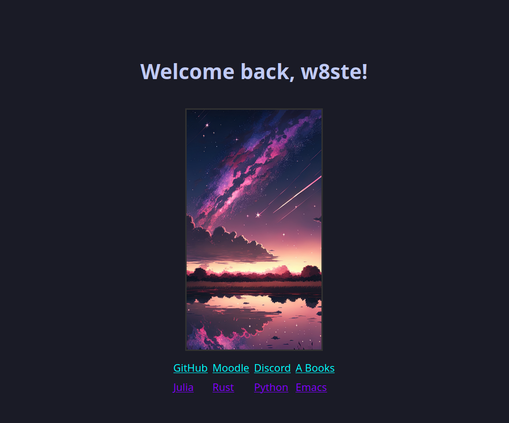

# Firefox Start Page

A minimalist custom start page for Firefox using pure HTML and CSS.

## Quick Links

| Category       | Links |
|----------------|-------|
| **Platforms**  | [GitHub](https://github.com), [Moodle](https://richtigesmoodle.de), [Discord](https://discord.com/channels/@me) |
| **Reading**    | [A Books](https://theanarchistlibrary.org/special/index) |
| **Docs**       | [Julia](https://docs.julialang.org/en/v1/), [Rust](https://doc.rust-lang.org/std/index.html), [Python](https://www.python.org/doc/), [Emacs](https://www.gnu.org/software/emacs/) |

## Screenshot

## Usage

1. Clone the repo into a local folder or fork it.
2. Set your Firefox start page to the HTML file (e.g., `file:///path/to/startpage.html`) or via GitHub pages.

---

